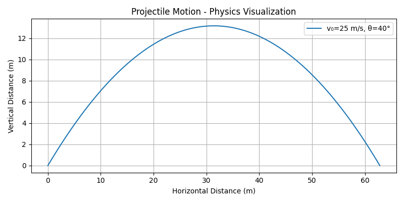

# Physics: Projectile Motion Visualizer

This tool simulates and visualizes the path of a projectile launched at a given velocity and angle. The output is a curve showing height versus distance, ideal for physics coursework or teaching.

### Features
- Adjustable velocity and launch angle
- Plots classic projectile path using kinematic equations
- Scientific visualization with Matplotlib

### Run it
- Edit `v0` and `theta_deg` in `projectile_motion.py` to change initial conditions.
- Run the script to generate `projectile_motion.png`.

### Example Chart

